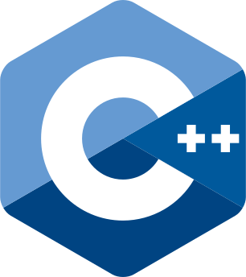
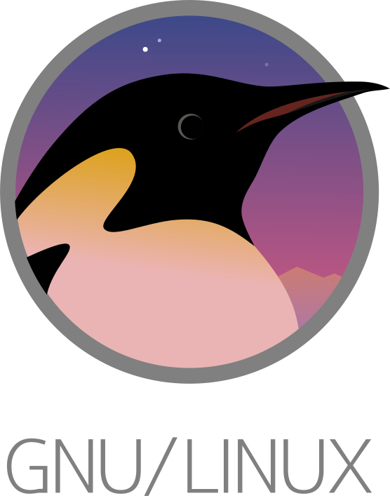

I am deeply passionate about technology. I enjoy continually expanding my stack by incorporating new tools to build better solutions

### Skills

    
    
    
    
    
    
    
    
        
    
    
    
    
    
    
    

In my future endeavors, I plan to delve into areas of interest such as Machine Learning, CI/CD, Cloud, etc.

### Learning / To Learn

    
    
    
    

I host my own [Twitch channel as ChrisVDev](https://twitch.tv/chrisvdev) in spanish, where viewers can see me working on projects alongside the community.

